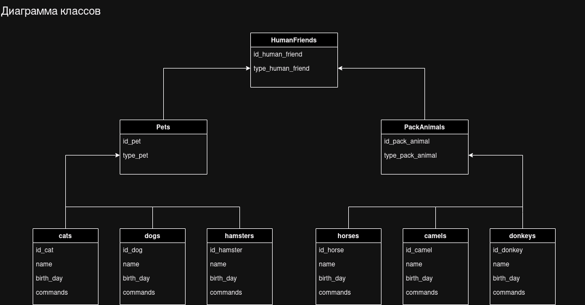

### [Итоговая контрольная работа по блоку специализация](https://gb.ru/lessons/440557/homework)

#### Ярохно Константин, группа 6024

#### Информация о проекте

Необходимо организовать систему учета для питомника в котором живут домашние и Pack animals.

##### Задание 1. Использование команды cat в Linux

- Создать два текстовых файла: `pets.txt` (Домашние животные) и `pack_animals`(вьючные животные), используя команду
  `cat` в терминале Linux. В первом файле перечислить собак, кошек и хомяков. Во втором — лошадей, верблюдов и ослов.
- Объединить содержимое этих двух файлов в один и просмотреть его содержимое.
- Переименовать получившийся файл в `human_friends.txt`.

```bash
mkdir test
cd test
ls

cat <<EOT >> pets.txt
cat
dog
hamster
EOT

# Проверяю:
cat pets.txt   
# Вывод:
cat  
dog  
hamster

cat <<EOT >> pack_animals.txt  
horse  
camel  
donkey
EOT

# Проверяю:
cat pack_animals.txt   
# Вывод:  
horse  
camel  
donkey

# Объединяю два файла в результирующий:  
cat pets.txt pack_animals.txt > animals.txt

# Проверяю:  
cat animals.txt   
# Вывод:  
cat  
dog  
hamster  
horse  
camel  
donkey  

# Переименовываю файл:  
mv animals.txt human_friends.txt  
# Проверяю:  
ls  
# Вывод:  
human_friends.txt  pack_animals.txt  pets.txt  
```

[История терминальных команд](1_OS_and_Virtualization/task_1.txt)

##### Задание 2. Работа с директориями в Linux

- Создать директорию, переместить файл туда.

```bash
mkdir newdir
mv human_friends.txt newdir

# Проверяю:
ls
# Вывод:
newdir  pack_animals.txt  pets.txt

ls newdir
# Вывод:
human_friends.txt
```

[История терминальных команд](1_OS_and_Virtualization/task_2.txt)

##### Задание 3. Работа с MySQL в Linux. “Установить MySQL на вашу вычислительную машину”

- Подключить дополнительный репозиторий MySQL.
- Установить один из пакетов из этого репозитория.

```bash
wget -c https://dev.mysql.com/get/mysql-apt-config_0.8.30-1_all.deb
sudo dpkg -i mysql-apt-config_0.8.30-1_all.deb

sudo apt update
sudo apt install mysql-server

# Проверяю:
systemctl status mysql
# Вывод:
● mysql.service - MySQL Community Server
     Loaded: loaded (/usr/lib/systemd/system/mysql.service; enabled; preset: enabled)
     Active: active (running) since Mon 2024-06-17 20:36:27 UTC; 1min 32s ago
       Docs: man:mysqld(8)
             http://dev.mysql.com/doc/refman/en/using-systemd.html
   Main PID: 2647 (mysqld)
     Status: "Server is operational"
      Tasks: 34 (limit: 4613)
     Memory: 430.9M (peak: 444.3M)
        CPU: 1.277s
     CGroup: /system.slice/mysql.service
             └─2647 /usr/sbin/mysqld

июн 17 20:36:26 ki systemd[1]: Starting mysql.service - MySQL Community Server...
июн 17 20:36:27 ki systemd[1]: Started mysql.service - MySQL Community Server.
```

[История терминальных команд](1_OS_and_Virtualization/task_3.txt)

##### Задание 4. Управление deb-пакетами

- Установить и удалить deb-пакет с помощью dpkg.

```bash
# загрузка пакета nginx
wget -c http://ftp.ru.debian.org/debian/pool/main/n/nginx/nginx_1.22.1-9_amd64.deb
# Устанавливаю пакет
sudo dpkg -i nginx_1.22.1-9_amd64.deb
# Исправление зависимостей…
sudo apt-get install -f

# Удаляю пакет
sudo dpkg -r nginx nginx-common
```

[История терминальных команд](1_OS_and_Virtualization/task_4.txt)

##### Задание 5. Выложить историю команд в терминале ubuntu

Вывожу крайние 40 команд:

```bash
history 40  
```

[История терминальных команд](1_OS_and_Virtualization/Screen.png)

##### Задание 6. Диаграмма классов

Создать диаграмму классов с родительским классом "Животные", и двумя подклассами: "Pets" и "Pack animals".

В составы классов которых в случае Pets войдут классы: собаки, кошки, хомяки, а в класс Pack animals войдут: Лошади,
верблюды и ослы.

Каждый тип животных будет характеризоваться (например, имена, даты рождения, выполняемые команды и т.д)

Диаграмму можно нарисовать в любом редакторе, такими как Lucidchart, Draw.io, Microsoft Visio и других.



```
HumanFriends
  - id_human_friend
  - type_human_friend

Pets (наследует от HumanFriends)
  - id_pet
  - type_pet

  Dogs (наследует от Pets)
    - id_dog
    - name
    - birth_day
    - commands

  Cats (наследует от Pets)
    - id_cat
    - name
    - birth_day
    - commands

  Hamsters (наследует от Pets)
    - id_hamster
    - name
    - birth_day
    - commands

PackAnimals (наследует от HumanFriends)
  - id_pack_animal
  - type_pack_animal

  Horses (наследует от PackAnimals)
    - id_horse
    - name
    - birth_day
    - commands

  Camels (наследует от PackAnimals)
    - id_camel
    - name
    - birth_day
    - commands

  Donkeys (наследует от PackAnimals)
    - id_donkey
    - name
    - birth_day
    - commands
```

##### Задание 7. Работа с MySQL (Задача выполняется в случае успешного выполнения задачи “Работа с MySQL в Linux. “Установить MySQL на вашу машину”)

После создания диаграммы классов в 6 пункте, в 7 пункте база данных "Human_Friends" должна быть структурирована в
соответствии с этой диаграммой. Например, можно создать таблицы, которые будут соответствовать классам "Pets" и "
Pack_animals", и в этих таблицах будут поля, которые характеризуют каждый тип животных (например, имена, даты рождения,
выполняемые команды и т.д.).

В ранее подключенном MySQL создать базу данных с названием "HumanFriends".

- Создать таблицы, соответствующие иерархии из вашей диаграммы классов.
- Заполнить таблицы данными о животных, их командах и датами рождения.
- Удалить записи о верблюдах и объединить таблицы лошадей и ослов.
- Создать новую таблицу для животных в возрасте от 1 до 3 лет и вычислить их возраст с точностью до месяца.
- Объединить все созданные таблицы в одну, сохраняя информацию о принадлежности к исходным таблицам.

> Создать базу данных с названием "HumanFriends"

```bash
mysql -u root -p
```

```sql
DROP database IF EXISTS HumanFriends;
CREATE database HumanFriends;
USE HumanFriends;

SHOW DATABASES;
# Вывод:
+--------------------+
| Database           |
+--------------------+
| HumanFriends       |
| information_schema |
| mysql              |
| performance_schema |
| sys                |
+--------------------+
5 rows in set (0,00 sec)
```

> Создать таблицы с иерархией из диаграммы в БД

```sql
DROP TABLE IF EXISTS HumanFriends;
CREATE TABLE HumanFriends (
    id_human_friend INT AUTO_INCREMENT PRIMARY KEY,
    type_human_friend VARCHAR(255)
);

DROP TABLE IF EXISTS Pets;
CREATE TABLE Pets (
    id_pet INT AUTO_INCREMENT PRIMARY KEY,
    type_pet VARCHAR(255),
    id_human_friend INT,
    FOREIGN KEY (id_human_friend) REFERENCES HumanFriends(id_human_friend)
);

DROP TABLE IF EXISTS PackAnimals;
CREATE TABLE PackAnimals (
    id_pack_animal INT AUTO_INCREMENT PRIMARY KEY,
    type_pack_animal VARCHAR(255),
    id_human_friend INT,
    FOREIGN KEY (id_human_friend) REFERENCES HumanFriends(id_human_friend)
);

DROP TABLE IF EXISTS Cats;
CREATE TABLE Cats (
    id_cat INT AUTO_INCREMENT PRIMARY KEY,
    name VARCHAR(255),
    birth_day DATE,
    commands TEXT,
    id_pet INT,
    FOREIGN KEY (id_pet) REFERENCES Pets(id_pet)
);

DROP TABLE IF EXISTS Dogs;
CREATE TABLE Dogs (
    id_dog INT AUTO_INCREMENT PRIMARY KEY,
    name VARCHAR(255),
    birth_day DATE,
    commands TEXT,
    id_pet INT,
    FOREIGN KEY (id_pet) REFERENCES Pets(id_pet)
);

DROP TABLE IF EXISTS Hamsters;
CREATE TABLE Hamsters (
    id_hamster INT AUTO_INCREMENT PRIMARY KEY,
    name VARCHAR(255),
    birth_day DATE,
    commands TEXT,
    id_pet INT,
    FOREIGN KEY (id_pet) REFERENCES Pets(id_pet)
);

DROP TABLE IF EXISTS Horses;
CREATE TABLE Horses (
    id_horse INT AUTO_INCREMENT PRIMARY KEY,
    name VARCHAR(255),
    birth_day DATE,
    commands TEXT,
    id_pack_animal INT,
    FOREIGN KEY (id_pack_animal) REFERENCES PackAnimals(id_pack_animal)
);

DROP TABLE IF EXISTS Camels;
CREATE TABLE Camels (
    id_camel INT AUTO_INCREMENT PRIMARY KEY,
    name VARCHAR(255),
    birth_day DATE,
    commands TEXT,
    id_pack_animal INT,
    FOREIGN KEY (id_pack_animal) REFERENCES PackAnimals(id_pack_animal)
);

DROP TABLE IF EXISTS Donkeys;
CREATE TABLE Donkeys (
    id_donkey INT AUTO_INCREMENT PRIMARY KEY,
    name VARCHAR(255),
    birth_day DATE,
    commands TEXT,
    id_pack_animal INT,
    FOREIGN KEY (id_pack_animal) REFERENCES PackAnimals(id_pack_animal)
);

SHOW TABLES;
# Вывод:
+------------------------+
| Tables_in_HumanFriends |
+------------------------+
| Camels                 |
| Cats                   |
| Dogs                   |
| Donkeys                |
| Hamsters               |
| Horses                 |
| HumanFriends           |
| PackAnimals            |
| Pets                   |
+------------------------+
9 rows in set (0,00 sec)

```

> Заполнение таблиц данными

```sql
INSERT INTO HumanFriends (type_human_friend) VALUES ('Pet'), ('PackAnimal');
INSERT INTO Pets (type_pet, id_human_friend) VALUES ('Cat', 1), ('Dog', 1), ('Hamster', 1);
INSERT INTO PackAnimals (type_pack_animal, id_human_friend) VALUES ('Horse', 2), ('Camel', 2), ('Donkey', 2);
INSERT INTO Cats (name, birth_day, commands, id_pet) VALUES ('Whiskers', '2022-01-01', 'sit, jump', 1);
INSERT INTO Dogs (name, birth_day, commands, id_pet) VALUES ('Rex', '2021-05-10', 'fetch, sit', 2);
INSERT INTO Hamsters (name, birth_day, commands, id_pet) VALUES ('Nibbles', '2023-03-20', 'run', 3);
INSERT INTO Horses (name, birth_day, commands, id_pack_animal) VALUES ('Thunder', '2019-07-15', 'run', 1);
INSERT INTO Camels (name, birth_day, commands, id_pack_animal) VALUES ('Sandy', '2020-10-30', 'carry', 2);
INSERT INTO Donkeys (name, birth_day, commands, id_pack_animal) VALUES ('Eeyore', '2022-02-14', 'carry', 3);

SELECT * FROM HumanFriends;
SELECT * FROM Pets;
SELECT * FROM PackAnimals;
SELECT * FROM Cats;
SELECT * FROM Dogs;
SELECT * FROM Hamsters;
SELECT * FROM Horses;
SELECT * FROM Camels;
SELECT * FROM Donkeys;
```

> Проверяю:

```sql
mysql> SELECT * FROM HumanFriends;
+-----------------+-------------------+
| id_human_friend | type_human_friend |
+-----------------+-------------------+
|               1 | Pet               |
|               2 | PackAnimal        |
+-----------------+-------------------+
2 rows in set (0,00 sec)

mysql> SELECT * FROM Pets;
+--------+----------+-----------------+
| id_pet | type_pet | id_human_friend |
+--------+----------+-----------------+
|      1 | Cat      |               1 |
|      2 | Dog      |               1 |
|      3 | Hamster  |               1 |
+--------+----------+-----------------+
3 rows in set (0,00 sec)

mysql> SELECT * FROM PackAnimals;
+----------------+------------------+-----------------+
| id_pack_animal | type_pack_animal | id_human_friend |
+----------------+------------------+-----------------+
|              1 | Horse            |               2 |
|              2 | Camel            |               2 |
|              3 | Donkey           |               2 |
+----------------+------------------+-----------------+
3 rows in set (0,00 sec)

mysql> SELECT * FROM Cats;
+--------+----------+------------+-----------+--------+
| id_cat | name     | birth_day  | commands  | id_pet |
+--------+----------+------------+-----------+--------+
|      1 | Whiskers | 2022-01-01 | sit, jump |      1 |
+--------+----------+------------+-----------+--------+
1 row in set (0,00 sec)

mysql> SELECT * FROM Dogs;
+--------+------+------------+------------+--------+
| id_dog | name | birth_day  | commands   | id_pet |
+--------+------+------------+------------+--------+
|      1 | Rex  | 2021-05-10 | fetch, sit |      2 |
+--------+------+------------+------------+--------+
1 row in set (0,00 sec)

mysql> SELECT * FROM Hamsters;
+------------+---------+------------+----------+--------+
| id_hamster | name    | birth_day  | commands | id_pet |
+------------+---------+------------+----------+--------+
|          1 | Nibbles | 2023-03-20 | run      |      3 |
+------------+---------+------------+----------+--------+
1 row in set (0,00 sec)

mysql> SELECT * FROM Horses;
+----------+---------+------------+----------+----------------+
| id_horse | name    | birth_day  | commands | id_pack_animal |
+----------+---------+------------+----------+----------------+
|        1 | Thunder | 2019-07-15 | run      |              1 |
+----------+---------+------------+----------+----------------+
1 row in set (0,00 sec)

mysql> SELECT * FROM Camels;
+----------+-------+------------+----------+----------------+
| id_camel | name  | birth_day  | commands | id_pack_animal |
+----------+-------+------------+----------+----------------+
|        1 | Sandy | 2020-10-30 | carry    |              2 |
+----------+-------+------------+----------+----------------+
1 row in set (0,00 sec)

mysql> SELECT * FROM Donkeys;
+-----------+--------+------------+----------+----------------+
| id_donkey | name   | birth_day  | commands | id_pack_animal |
+-----------+--------+------------+----------+----------------+
|         1 | Eeyore | 2022-02-14 | carry    |              3 |
+-----------+--------+------------+----------+----------------+
1 row in set (0,00 sec)

```

> Удаление записей о верблюдах

```sql
mysql> DELETE FROM Camels;
Query OK, 1 row affected (0,00 sec)

mysql> SELECT * FROM Camels;
Empty set (0,01 sec)

```

> Объединение таблиц лошадей и ослов

```sql
DROP TABLE IF EXISTS HorsesAndDonkeys;
CREATE TABLE HorsesAndDonkeys AS
SELECT id_horse AS id, name, birth_day, commands, 'Horse' AS type FROM Horses
UNION
SELECT id_donkey AS id, name, birth_day, commands, 'Donkey' AS type FROM Donkeys;
```

> Проверяю:

```sql
mysql> SELECT * FROM HorsesAndDonkeys;
+----+---------+------------+----------+--------+
| id | name    | birth_day  | commands | type   |
+----+---------+------------+----------+--------+
|  1 | Thunder | 2019-07-15 | run      | Horse  |
|  1 | Eeyore  | 2022-02-14 | carry    | Donkey |
+----+---------+------------+----------+--------+
2 rows in set (0,00 sec)

```

> Создание новой таблицы для животных в возрасте от 1 до 3 лет (от 12 до 36 месяцев)

```sql
DROP TABLE IF EXISTS YoungAnimals;
CREATE TABLE YoungAnimals AS
SELECT id, name, birth_day, commands, type,
       TIMESTAMPDIFF(MONTH, birth_day, CURDATE()) AS age_in_months
FROM (
    SELECT id_cat AS id, name, birth_day, commands, 'Cat' AS type FROM Cats
    UNION ALL
    SELECT id_dog AS id, name, birth_day, commands, 'Dog' AS type FROM Dogs
    UNION ALL
    SELECT id_hamster AS id, name, birth_day, commands, 'Hamster' AS type FROM Hamsters
    UNION ALL
    SELECT id AS id, name, birth_day, commands, type FROM HorsesAndDonkeys
) AS AllAnimals
WHERE TIMESTAMPDIFF(MONTH, birth_day, CURDATE()) BETWEEN 12 AND 36;
```

> Проверяю:

```sql
mysql> SELECT * FROM YoungAnimals;
+----+----------+------------+-----------+---------+---------------+
| id | name     | birth_day  | commands  | type    | age_in_months |
+----+----------+------------+-----------+---------+---------------+
|  1 | Whiskers | 2022-01-01 | sit, jump | Cat     |            30 |
|  1 | Nibbles  | 2023-03-20 | run       | Hamster |            15 |
|  1 | Eeyore   | 2022-02-14 | carry     | Donkey  |            29 |
+----+----------+------------+-----------+---------+---------------+
3 rows in set (0,00 sec)
```

> Объединение всех созданных таблиц в одну

```sql
DROP TABLE IF EXISTS AllAnimals;
CREATE TABLE AllAnimals AS
SELECT id_cat AS id, name, birth_day, commands, 'Cat' AS type FROM Cats
UNION
SELECT id_dog AS id, name, birth_day, commands, 'Dog' AS type FROM Dogs
UNION
SELECT id_hamster AS id, name, birth_day, commands, 'Hamster' AS type FROM Hamsters
UNION
SELECT id AS id, name, birth_day, commands, type FROM HorsesAndDonkeys
UNION
SELECT id AS id, name, birth_day, commands, type FROM YoungAnimals;
```

> Проверяю:

```sql
mysql> SELECT * FROM AllAnimals;
+----+----------+------------+------------+---------+
| id | name     | birth_day  | commands   | type    |
+----+----------+------------+------------+---------+
|  1 | Whiskers | 2022-01-01 | sit, jump  | Cat     |
|  1 | Rex      | 2021-05-10 | fetch, sit | Dog     |
|  1 | Nibbles  | 2023-03-20 | run        | Hamster |
|  1 | Thunder  | 2019-07-15 | run        | Horse   |
|  1 | Eeyore   | 2022-02-14 | carry      | Donkey  |
+----+----------+------------+------------+---------+
5 rows in set (0,00 sec)

mysql> exit
Bye
ki@ki:~$ exit
logout
Connection to 192.168.1.139 closed.
```

Файл с sql-скриптом

##### Задание 8. Создать иерархию классов в Java, которые будут повторять диаграмму классов созданную в задаче 6 (Диаграмма классов)

> Задание выполнено в ходе написания кода программы

##### Задание 9. Программа-реестр домашних животных

Написать программу на Java, которая будет имитировать реестр домашних животных.

В программе должен быть реализован следующий функционал:

***Добавление нового животного:*** Реализовать функциональность для добавления новых животных в реестр. Животное должно
определяться в правильный класс (например, "собака", "кошка", "хомяк" и т.д.)

***Список команд животного:*** Вывести список команд, которые может выполнять добавленное животное (например, "
сидеть", "лежать").

***Обучение новым командам:*** Добавить возможность обучать животных новым командам.

***Вывести список животных по дате рождения***

***Навигация по меню:*** Реализовать консольный пользовательский интерфейс с меню для навигации между вышеуказанными
функциями.

> Функционал приложения описан в файле [README.md](HumanFriends/README.md) в папке с проектом.

##### Задание 10. Счетчик животных

Создать механизм, который позволяет вывести на экран общее количество созданных животных любого типа (Как домашних, так
и вьючных), то есть при создании каждого нового животного счетчик увеличивается на “1”.